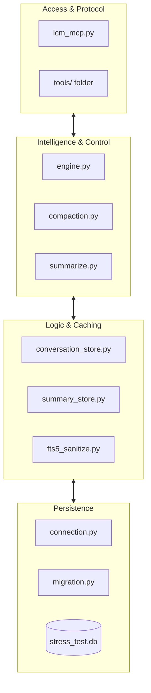
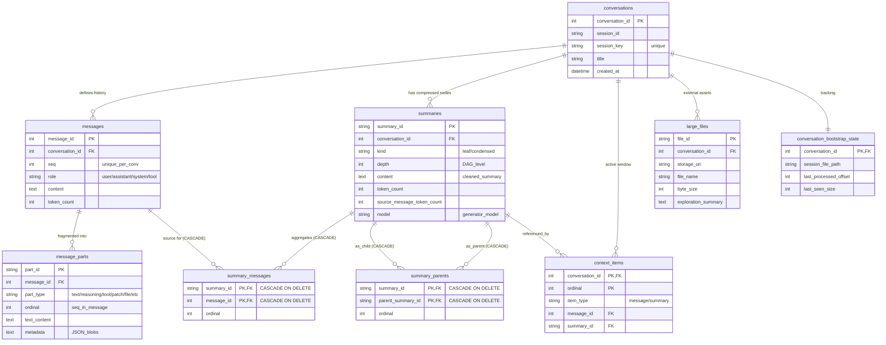

# Lossless Context Management (LCM) - Technical Specification

Lossless Context Management (LCM) is the core memory architecture of AgenticOS, designed to provide LLMs with a "permanent memory" that scales indefinitely while maintaining 100% data integrity on edge devices.

---

## 1. System Architecture

LCM is structured into four distinct horizontal layers, ensuring separation of concerns between storage persistence and high-level agent interaction.

---

## 2. Physical Data Model (Database Schema)

LCM utilizes a sophisticated 9-table schema in SQLite (managed by `migration.py`) to handle multi-modal message parts and recursive summary structures.

### 2.1 Core Tables Breakdown
*   **`conversations`**: Tracks sessions, titles, and bootstrap states.
*   **`messages`**: Source of truth for raw dialogue. Immutable once written.
*   **`message_parts`**: Highly granular storage for different content types (Text, Reasoning, Tool Calls, Patches, Files, etc.). Supports 13+ specialized part types.
*   **`summaries`**: Stores the compressed Nodes. Attributes include `depth` (DAG level), `token_count`, and `source_message_token_count`.
*   **`context_items`**: The "Active Window" pointer table. Determines what is currently visible to the LLM.
*   **`large_files`**: Registry for files externalized from the context to save VRAM.

### 2.2 Relation & DAG Tables
*   **`summary_messages`**: Links Summary Nodes to their original Raw Messages.
*   **`summary_parents`**: The backbone of the **Recursive DAG**. Links child summaries to parent summaries, enabling multi-level "zooming."

---

## 3. Compaction Lifecycle (3-Level Defense)

The `CompactionEngine` in `compaction.py` prevents "Context Rot" by triggering background compression when tokens exceed **55% of the budget**.

### The Escalation Strategy:
1.  **Level 1: Synthesis (Standard)**: Uses a small LLM to synthesize a logical summary of the oldest block in the window.
2.  **Level 2: Point Extraction (Aggressive)**: Triggered if Level 1 fails to reduce tokens significantly. Forces the LLM to output ultra-dense bullet points.
3.  **Level 3: Deterministic Truncation (Safety Fallback)**: A pure Python logic that "chops" the oldest items to guarantee context window recovery, ensuring the system never crashes due to LLM failure.

> [!TIP]
> **QA Protection (Fresh Tail Logic)**: LCM always preserves at least 6 messages (3 Q&A pairs) at the end of the history to maintain immediate conversation coherence, even during aggressive compaction.

---

## 4. Advanced Memory Access Tools

Agents interact with deep history via a set of specialized tools that bypass the active context window.

| Tool | Source | Logic |
| :--- | :--- | :--- |
| **`lcm_grep`** | `tools/lcm_grep.py` | Uses **SQLite FTS5** (Porter stemmer + unicode61) for sub-millisecond keyword searches across all history. |
| **`lcm_describe`** | `tools/lcm_describe.py` | Provides metadata about a Summary Node (timeframe, count, depth) so the Agent can decide if it needs to see the full content. |
| **`lcm_expand`** | `tools/lcm_expand.py` | Uses **Recursive Common Table Expressions (CTEs)** to drill down to the original raw verbatim messages. |

---

## 5. Technical Philosophies

*   **Verbatim Recall**: Unlike RAG (which returns slices), LCM's `expand` tool returns the *exact* original conversation turn, ensuring logic isn't lost in translation.
*   **Prompt Leakage Sanitization**: `summary_store.py` includes a `_sanitize_content` filter that strips internal XML tags (like `<think>`, `<previous_context>`) before saving to DB, preventing meta-prompts from infecting the history.

---
*Implementation Version: Python-native (Ported from TypeScript/lossless-claw)*