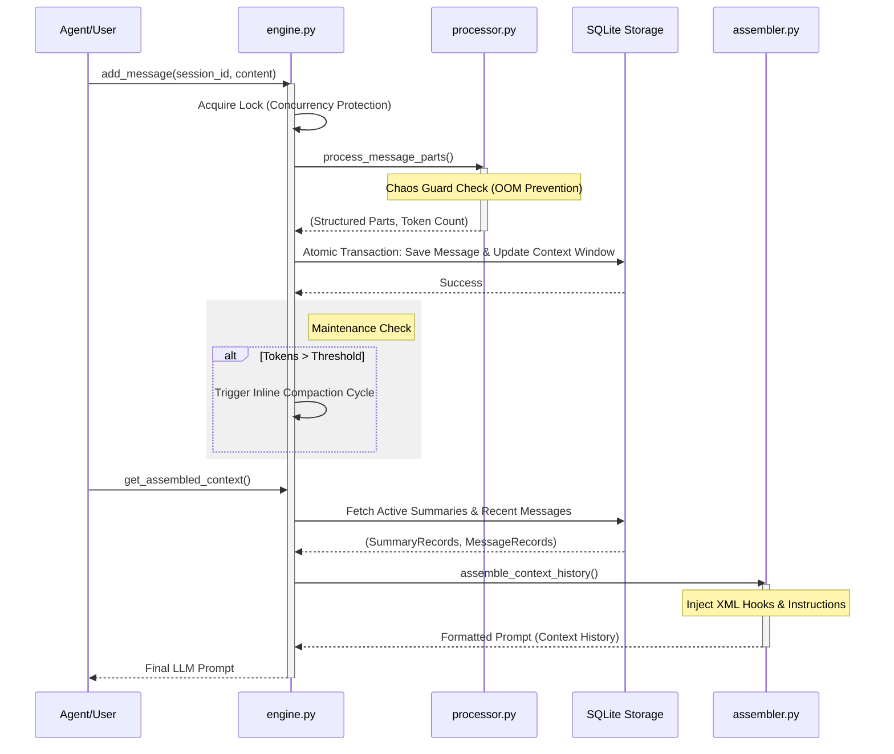

# LCM Technical Design: Part 1 - Core Orchestration Layer

Tài liệu này phân tích chi tiết luồng thực thi và trách nhiệm của các thành phần thuộc **Tầng Điều Phối Trung Tâm** trong hệ thống Lossless Context Management (LCM).

---

## 1. Mục đích chung

Tầng Điều Phối Trung Tâm đóng vai trò là "Gateway" và "CPU" của hệ thống LCM. Nhiệm vụ chính là tiếp nhận các yêu cầu nạp dữ liệu (Ingestion), chuẩn hóa nội dung (Processing), và lắp ráp bối cảnh (Assembly) để cung cấp cho LLM một cái nhìn tối ưu về lịch sử hội thoại mà không vượt quá giới hạn Token.

---

## 2. Chi tiết từng file

### config.py (System Configuration)
- **Trách nhiệm**: Quản lý toàn bộ tham số vận hành của LCM với cơ chế ưu tiên 3 tầng: Biến môi trường > Plugin Config > Defaults.
- **Input**: Dictionary cấu hình từ hệ thống hoặc biến môi trường `LCM_*`.
- **Output**: Đối tượng `LcmConfig` (Pydantic Model) chứa các hằng số như `context_threshold`, `fresh_tail_count`, và `database_path`.

### types.py (Core Type Definitions)
- **Trách nhiệm**: Định nghĩa "ngôn ngữ chung" cho toàn bộ module thông qua các Enums, Protocols và Dataclasses. Đây là xương sống giúp hệ thống đạt tính Type-safe.
- **Input**: N/A.
- **Output**: Các định nghĩa như `MessageRecord`, `SummaryRecord`, `ContextItemType` và Interface `TokenizerProtocol`.

### tokenizer_util.py (Token Management)
- **Trách nhiệm**: Cung cấp công cụ đếm token chính xác. Nó trừu tượng hóa các thư viện như `tiktoken` hoặc `transformers` để đảm bảo LCM tính toán dung lượng bối cảnh đồng nhất.
- **Input**: Chuỗi văn bản thô.
- **Output**: Danh sách token IDs hoặc số lượng token (integer).

### engine.py (Central Orchestrator)
- **Trách nhiệm**: Class `LcmEngine` là điểm vào duy nhất của hệ thống, điều phối sự tương tác giữa Storage, Processor và Compaction. Nó đảm bảo tính toàn vẹn dữ liệu thông qua cơ chế Lock và Giao dịch (Transactions).
- **Input**: Raw Message Content, Session ID, Role.
- **Output**: `MessageRecord` và kết quả kích hoạt bảo trì (Maintenance).

### processor.py (Input Pre-processor)
- **Trách nhiệm**: Chuẩn hóa tin nhắn thô, phân tách nội dung thành các phần (parts) và thực thi **Chaos Guard** (hàng rào chặn dữ liệu cực lớn để tránh lỗi OOM).
- **Input**: Danh sách các `part` thô từ Agent.
- **Output**: Một bộ gồm (Structured Parts, Total Tokens, Merged Content).

### assembler.py (Context Hydrator)
- **Trách nhiệm**: Lấy dữ liệu thô từ DB và các bản tóm tắt (Summaries), sau đó "đóng gói" chúng thành định dạng XML (`<context_history>`) kèm theo các chỉ dẫn Meta-instruction cho LLM.
- **Input**: Danh sách `SummaryRecord` và `MessageRecord`.
- **Output**: Chuỗi Prompt hoàn chỉnh kèm block `<lcm_metadata>`.

### file_dispatcher.py (Exception Handler for Bloat)
- **Trách nhiệm**: Phát hiện các khối dữ liệu quá lớn (Large Files/Logs) nằm trong luồng chat và "đẩy" chúng ra khỏi bộ nhớ RAM chính, thay thế bằng các liên kết mô tả hoặc tóm tắt sơ bộ.
- **Input**: Message parts hoặc File streams.
- **Output**: Metadata của file đã externalize.

---

## 3. Workflow thực thi (Step-by-Step)

Quy trình xử lý một tin nhắn mới đi vào hệ thống diễn ra như sau:

1. **Step 1: Receipt (engine.py)**  
   `LcmEngine.add_message` tiếp nhận nội dung. Nó kích hoạt một `asyncio.Lock` dựa trên `session_id` để ngăn chặn việc ghi đè dữ liệu đồng thời.

2. **Step 2: Pre-processing (processor.py)**  
   Nội dung được chuyển sang `LcmProcessor.process_message_parts`.  
   - **Logic rẽ nhánh**: `if len(text) > char_limit`, hệ thống thực thi **Hard Boundary Truncation** ngay lập tức để bảo vệ bộ nhớ.  
   - Toàn bộ Text được đi qua `sanitize_summary_content` để xóa bỏ các rò rỉ từ LLM cũ (CoT, Think tags).

3. **Step 3: Atomic Ingestion (engine.py + DB)**  
   `engine.py` mở một giao dịch cơ sở dữ liệu (`Pool.execute_in_transaction`).  
   - Lưu `MessageRecord` vào bảng `messages`.  
   - Lưu các phần đã xử lý vào `message_parts`.  
   - Quan trọng: Chèn một tham chiếu mới vào bảng `context_items` (Context Window).

4. **Step 4: Compaction Evaluation (engine.py + config.py)**  
   Hệ thống kiểm tra: `if total_tokens > context_budget * context_threshold`.  
   - Nếu **True**: Kích hoạt luồng nén (`CompactionEngine`).  
   - Nếu **False**: Kết thúc luồng Ingestion.

5. **Step 5: Hydration & Delivery (assembler.py)**  
   Khi Agent cần gửi prompt cho LLM, `LcmEngine.get_assembled_context` được gọi:  
   - `assembler.py` lấy các bản tóm tắt và tin nhắn gần nhất.  
   - Nó tiêm (Inject) thẻ `<instruction>` yêu cầu LLM phải gọi `lcm_expand` nếu gặp một nút tóm tắt lạ.

---

## 4. Sơ đồ Mermaid: Message Ingestion & Assembly

---
*Tài liệu này thuộc kho tài liệu kỹ thuật cốt lõi của AgenticOS.*
