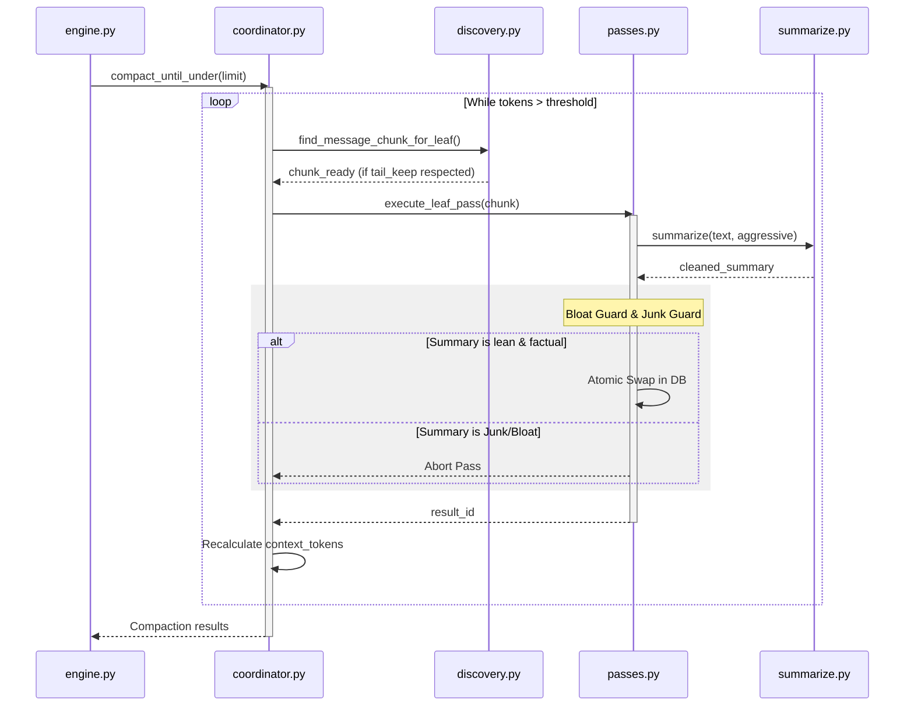

# LCM Technical Design: Part 2 - Compaction & Summarization Layer

Tài liệu này phân tích chi tiết luồng thực thi của các thành phần chịu trách nhiệm nén bối cảnh và tóm tắt dữ liệu bằng LLM trong hệ thống AgenticOS.

---

## 1. Mục đích chung

Tầng Nén & Phân Tích có nhiệm vụ giảm tải dung lượng Token trong cửa sổ bối cảnh (Context Window) mà không làm mất đi các thông tin quan trọng. Nó hoạt động bằng cách quét các hạt dữ liệu (tin nhắn hoặc tóm tắt cũ), nhóm chúng lại và sử dụng LLM để tạo ra các "Nút tóm tắt" (Summary Nodes) đại diện cho các phân đoạn đó trong đồ thị DAG (Directed Acyclic Graph).

---

## 2. Chi tiết từng file

### coordinator.py (Compaction Orchestrator)
- **Trách nhiệm**: Class `CompactionEngine` đóng vai trò là "Nhạc trưởng" điều phối quy trình nén hội tụ (Convergence). Nó không chứa logic tìm kiếm dữ liệu mà chỉ quản lý vòng lặp nén cho đến khi dung lượng Context đạt ngưỡng an toàn.
- **Input**: `conversation_id`, `context_limit`.
- **Output**: Danh sách `CompactionResult` mô tả số lượng token trước và sau khi nén.

### discovery.py (Candidate Discovery)
- **Trách nhiệm**: Chứa các thuật toán "Thăm dò" để tìm ra đoạn dữ liệu nào có thể nén được. Nó đảm bảo tính an toàn bằng cách bảo vệ các tin nhắn mới nhất (Fresh Tail).
- **Input**: Danh sách `ContextItemRecord` hiện tại.
- **Output**: Các "Chunks" dữ liệu (tập hợp các ID tin nhắn hoặc ID tóm tắt) kèm theo vị trí bắt đầu (`start_idx`).

### passes.py (Execution Passes)
- **Trách nhiệm**: Thực thi các vòng nén cụ thể (Leaf Pass cho tin nhắn thô, Condensed Pass cho tóm tắt cấp cao). Đây là nơi thực hiện các giao dịch cơ sở dữ liệu `Atomic` để thay thế dữ liệu cũ bằng dữ liệu mới.
- **Input**: ID cuộc hội thoại và trạng thái `aggressive`.
- **Output**: ID của bản tóm tắt mới (`summary_id`) hoặc `None` nếu thất bại.

### summarize.py (LLM Interface & Guards)
- **Trách nhiệm**: Quản lý giao diện gọi LLM API. Chứa các "Chốt chặn" (Guards) quan trọng để đảm bảo chất lượng tóm tắt: Xóa lời dẫn giải (Preamble Stripper), chặn tóm tắt rỗng (Junk Guard), và ngăn chặn hiện tượng "Phình to bối cảnh" (Bloat Guard).
- **Input**: Văn bản thô cần tóm tắt.
- **Output**: Chuỗi tóm tắt sạch (Natural Narrative).

### prompts.py (Recursive Templating)
- **Trách nhiệm**: Định nghĩa các mẫu Prompt đệ quy phù hợp với độ sâu của dữ liệu (Node Depth). Quyết định mục tiêu nén (bao nhiêu token) dựa trên dung lượng đầu vào.
- **Input**: Metadata về độ sâu và dung lượng token.
- **Output**: Chuỗi hướng dẫn (Instruction) cho LLM.

---

## 3. Workflow thực thi (Step-by-Step)

Quy trình nén thường được kích hoạt sau mỗi tin nhắn mới nếu tổng Token vượt ngưỡng `context_threshold` (mặc định 55% budget).

1. **Step 1: Evaluation (coordinator.py)**  
   `CompactionEngine.evaluate` tính toán tổng token hiện tại. 
   - **Logic rẽ nhánh**: `if current_tokens > limit * threshold` -> Bắt đầu vòng lặp `compact_until_under`.

2. **Step 2: Candidate Discovery (discovery.py)**  
   Hệ thống gọi `find_message_chunk_for_leaf` trước.  
   - **Quy tắc bảo vệ**: Luôn bỏ lại 2-3 tin nhắn cuối cùng (`tail_keep`) để LLM luôn thấy được câu hỏi mới nhất của người dùng dưới dạng văn bản thô. Điều này đảm bảo tính "trực quan" (Freshness) cho hội thoại.

3. **Step 3: Executive Pass (passes.py)**  
   Dựa trên kết quả Discovery, hệ thống thực thi `execute_leaf_pass` hoặc `execute_condensed_pass`.
   - **Pre-summarization (Chaos Guard)**: Nếu một tin nhắn đơn lẻ quá lớn (> 6000 tokens), nó sẽ bị cắt bớt bằng thuật toán `deterministic_fallback` trước khi gửi cho LLM để tránh lãng phí chi phí và đảm bảo hiệu năng.

4. **Step 4: LLM Summarization (summarize.py)**  
   Gọi LLM thông qua provider được cấu hình.
   - **Normalization**: `normalize_completion_summary` sẽ cắt bỏ các câu thừa như "Sure!", "Here is the summary...".
   - **Security Check (Bloat Guard)**: `if tokens_after >= tokens_before * 1.15`, tóm tắt bị từ chối vì nó làm bối cảnh phình to hơn là co lại.

5. **Step 5: Atomic Persistence (CRUD Layer)**  
   Bản tóm tắt mới được lưu vào bảng `summaries`. Cửa sổ bối cảnh `context_items` được cập nhật: Xóa các tin nhắn con và thay thế bằng 1 bản ghi Summary duy nhất tại vị trí đó trong một **Atomic Transaction**.

6. **Step 6: Escalation (coordinator.py)**  
   Nếu sau vệt nén đầu tiên bối cảnh vẫn quá lớn, `Escalation Level` sẽ được nâng lên `aggressive=True` (nén mạnh hơn, rút ngắn target_tokens của LLM).

---

## 4. Sơ đồ Mermaid: Compaction Cycle Interaction

---
*Tài liệu này thuộc kho tài liệu kỹ thuật cốt lõi của AgenticOS.*
