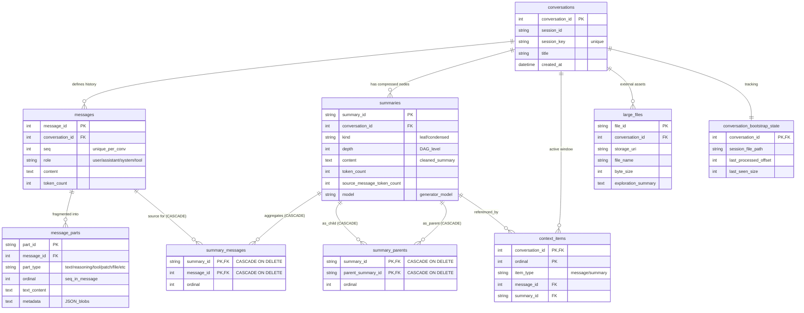
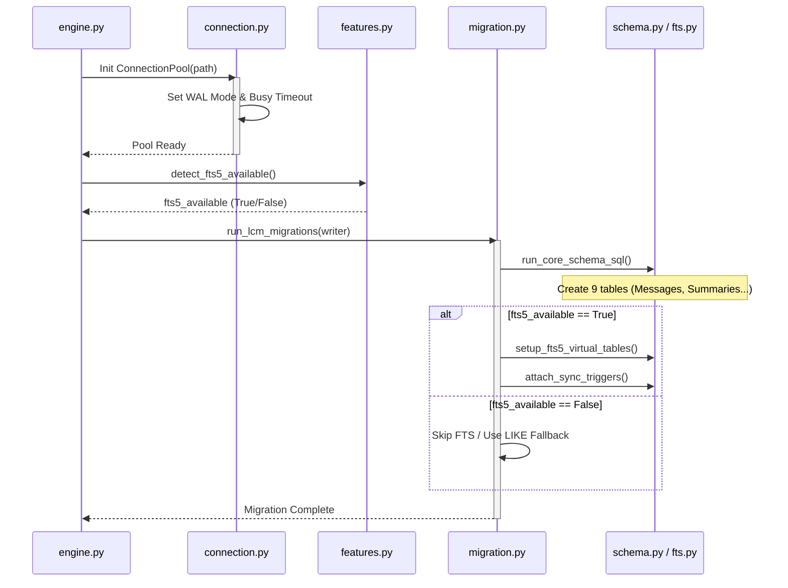

# LCM Technical Design: Part 3 - Physical Database & Migration Layer

Tài liệu này phân tích chi tiết tầng lưu trữ vật lý của hệ thống Lossless Context Management (LCM), tập trung vào cách quản lý kết nối SQLite, bảo mật luồng (Concurrency) và tính toàn vẹn của Schema.

---

## 1. Mục đích chung

Tầng Nền Tảng Vật Lý chịu trách nhiệm xây dựng một "Hạ tầng kiên cố" cho LCM. Nhiệm vụ cốt lõi là giải quyết các vấn đề đặc thù của SQLite như:
- **Concurrency**: Ngăn chặn lỗi "Database is locked" khi quá trình nén (Compaction) chạy ngầm cùng lúc với việc người dùng chat.
- **Search Performance**: Cung cấp khả năng tìm kiếm toàn văn FTS5 siêu nhanh.
- **Data Integrity**: Đảm bảo Schema luôn được cập nhật tự động (Auto-migration) khi có phiên bản mới.

---

## 2. Mô hình Dữ liệu Vật lý (Database Schema)

LCM sử dụng cấu trúc 9 bảng phức tạp trong SQLite để quản lý các thành phần tin nhắn đa phương thức và kiến trúc tóm tắt đệ quy.

---

## 3. Chi tiết từng file

### connection.py (Connection Pool & Concurrency)
- **Trách nhiệm**: Quản lý `ConnectionPool` với kiến trúc một Writer duy nhất và nhiều Reader. Nó sử dụng chế độ **WAL (Write-Ahead Logging)** để cho phép đọc và ghi diễn ra đồng thời.
- **Input**: Đường dẫn file DB (`db_path`), timeout.
- **Output**: Một đối tượng kết nối `sqlite3.Connection` đã được tối trừu hóa (Pragmas tối ưu).

### features.py (SQLite Capability Detection)
- **Trách nhiệm**: Kiểm tra xem môi trường Runtime hiện tại có hỗ trợ các tính năng nâng cao của SQLite hay không, cụ thể là **FTS5** (Full-Text Search).
- **Input**: Một đối tượng connection đang mở.
- **Output**: Boolean (True/False) báo cáo khả năng hỗ trợ FTS5.

### migration/schema.py (Core Table Definitions)
- **Trách nhiệm**: Chứa mã nguồn SQL "nguyên tử" để khởi tạo 9 bảng cốt lõi (Conversations, Messages, Summaries, Context Items, v.v.). Nó định nghĩa các ràng buộc khóa ngoại (Foreign Keys) để bảo vệ phả hệ DAG.
- **Input**: Đối tượng connection có quyền Write.
- **Output**: Cơ sở dữ liệu với cấu trúc bảng hoàn chỉnh.

### migration/fts.py (Search Engine Setup)
- **Trách nhiệm**: Thiết lập các bảng ảo (Virtual Tables) và các **Triggers**. Triggers tự động đồng bộ hóa dữ liệu từ bảng `messages` sang bảng nén search để Agent có thể `lcm_grep` tức thì.
- **Input**: Đối tượng connection.
- **Output**: Hệ thống tìm kiếm toàn văn tự động.

### migration/backfill.py (Data Migration logic)
- **Trách nhiệm**: Xử lý việc di chuyển dữ liệu (Data Migration) hoặc cập nhật các cột bị thiếu (ví dụ: thêm cột `ordinal` hoặc `token_count` cho dữ liệu cũ).
- **Input**: Existing Database.
- **Output**: Database đã được nâng cấp lên version mới nhất mà không mất dữ liệu.

---

## 4. Workflow thực thi (Step-by-Step)

Quy trình khởi tạo và migration diễn ra mỗi khi hệ thống `LcmEngine` bắt đầu chạy:

1. **Step 1: Pool Creation (connection.py)**  
   Hệ thống khởi tạo `ConnectionPool`. Ngay lập tức, lệnh `PRAGMA journal_mode = WAL` được thực thi. Điều này cực kỳ quan trọng để đảm bảo Compaction (chạy background) không chặn luồng chính của người dùng.

2. **Step 2: Feature Detection (features.py)**  
   Hệ thống kiểm tra `fts5_available`. Nếu môi trường không hỗ trợ (ví dụ: một số bản build Python rút gọn), LCM sẽ tự động rẽ nhánh sang chế độ tìm kiếm dự phòng (Fallback) bằng lệnh `LIKE %query%`.

3. **Step 3: Sequential Migration (migration.py)**  
   Hệ thống chạy hàm `run_lcm_migrations` theo thứ tự "Bậc thang":
   - **Tầng 1 (Core Schema)**: Tạo các bảng vật lý và index.
   - **Tầng 2 (Lineage Constraints)**: Thiết lập khóa ngoại và các index cho bảng `summary_parents`.
   - **Tầng 3 (Search & Sync)**: Nếu có FTS5, tạo bảng ảo và gắn Triggers.

4. **Step 4: Atomic Transactions (connection.py)**  
   Mọi thay đổi dữ liệu lớn (như nén tóm tắt) đều được thực hiện qua `execute_in_transaction`.
   - **Logic rẽ nhánh**: Nếu gặp bất kỳ lỗi gì (Full disk, SQL error), lệnh `ROLLBACK` sẽ được gọi ngay lập tức để bảo vệ trạng thái cũ.

---

## 5. Sơ đồ Mermaid: Database Initialization & Migration

---
*Tài liệu này thuộc kho tài liệu kỹ thuật cốt lõi của AgenticOS.*
