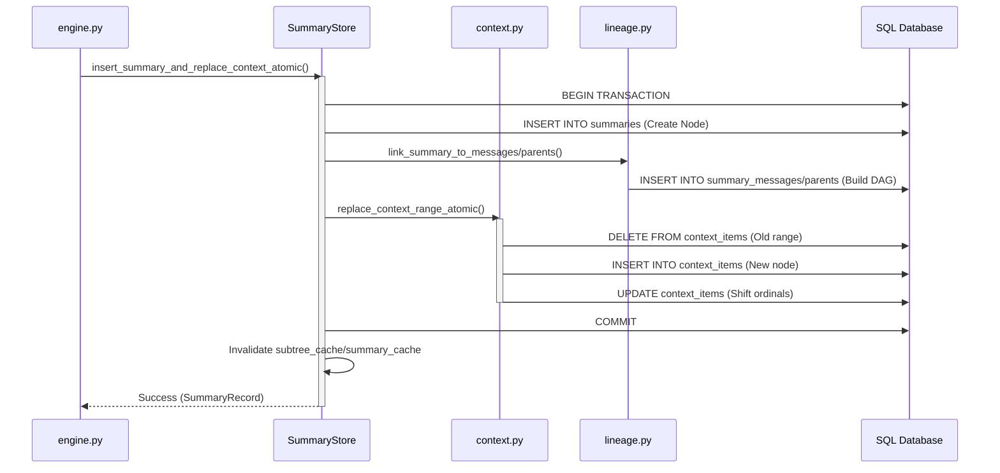

# LCM Technical Design: Part 4 - Storage & Facades Layer

Tài liệu này bóc tách kiến trúc tầng giao tiếp dữ liệu của LCM, tập trung vào cách hệ thống trừu tượng hóa các câu lệnh SQL phức tạp và quản lý phả hệ tóm tắt bằng kiến trúc Facade/Mixin.

---

## 1. Mục đích chung

Tầng Giao Tiếp Dữ Liệu đóng vai trò là "Vỏ bọc thông minh" bao quanh cơ sở dữ liệu vật lý. Nhiệm vụ chính là:
- **Abstractions**: Cung cấp API đơn giản cho Engine mà không để lộ các câu lệnh SQL đệ quy.
- **Atomic Operations**: Đảm bảo các thao tác thay thế bối cảnh diễn ra nguyên tử (không bao giờ xảy ra tình trạng mất tin nhắn giữa chừng).
- **Fidelity Recall**: Sử dụng các truy vấn đệ quy (Recursive CTE) để dựng lại cấu trúc cây từ các bản tóm tắt nén.

---

## 2. Chi tiết từng file

### summary_store.py (Consolidated Facade)
- **Trách nhiệm**: Class `SummaryStore` sử dụng mô hình **Multiple Inheritance (Mixin)** để kết hợp các Facade riêng lẻ. Nó chứa lớp Cache bổ sung (`TTLCache`) để tối ưu hóa hiệu năng cho các truy vấn cây phả hệ lặp lại.
- **Input**: `ConnectionPool`.
- **Output**: Một Interface thống nhất cho mọi thao tác liên quan đến Summaries và DAG.

### facades/ (The Mixins)
- **`summary_facade.py`**: Chịu trách nhiệm CRUD cơ bản cho bảng `summaries`.
- **`context_facade.py`**: Quản lý bảng `context_items`. Cho phép truy vấn tổng token hiện tại của cửa sổ chat.
- **`lineage_facade.py`**: Giao diện để liên kết bản tóm tắt với tin nhắn gốc hoặc với các bản tóm tắt cha/con.

### context.py (Context Window Logic)
- **Trách nhiệm**: Chứa logic "nặng" nhất về việc dịch chuyển số thứ tự (`ordinal`). Khi một dải 10 tin nhắn bị xóa và thay bằng 1 bản tóm tắt, file này thực hiện phép tính để dồn hàng (shift) các tin nhắn phía sau.
- **Input**: `start_ordinal`, `end_ordinal`.
- **Output**: Một bảng `context_items` đã được tái cấu trúc chính xác.

### lineage.py (DAG Traversal Logic)
- **Trách nhiệm**: Chứa các câu lệnh **Recursive CTE (Common Table Expressions)**. Đây là nơi thực hiện phép thuật "giải nén" bộ nhớ bằng cách duyệt ngược từ một Nút cha xuống toàn bộ các Nút con và tin nhắn gốc.
- **Input**: `summary_id`.
- **Output**: Một danh sách `SummarySubtreeNode` chứa toàn bộ cây phả hệ.

---

## 3. Workflow thực thi (Step-by-Step)

### Luồng "Atomic Swap" (Thay thế bối cảnh)
Khi Compaction kết thúc và có một bản tóm tắt mới:
1. **Step 1**: Gọi `insert_summary_and_replace_context_atomic` trong `SummaryStore`.
2. **Step 2**: Giao dịch SQLite được mở. Một bản ghi mới được ghi vào `summaries`.
3. **Step 3**: `context.py` thực hiện lệnh `DELETE` dải tin nhắn cũ trong `context_items`.
4. **Step 4**: Bản tóm tắt mới được `INSERT` vào đúng `start_ordinal`.
5. **Step 5**: Một lệnh `UPDATE` được chạy để giảm `ordinal` của tất cả các tin nhắn phía sau đi một khoảng `(end - start)`, giữ cho chuỗi hội thoại luôn liên tục.

### Luồng "Fidelity Recall" (Truy xuất phả hệ)
Khi Agent gọi công cụ `lcm_expand`:
1. **Step 1**: `SummaryStore.get_subtree(summary_id)` được gọi.
2. **Step 2**: Hệ thống kiểm tra `subtree_cache`. Nếu có kết quả thì trả về ngay.
3. **Step 3**: Nếu không, `lineage.py` chạy truy vấn đệ quy `WITH RECURSIVE`.
4. **Step 4**: SQL sẽ tự động duyệt qua bảng `summary_parents` để tìm mọi liên kết cha-con cho đến khi chạm tới các lá (tin nhắn thô).
5. **Step 5**: Kết quả được đóng gói vào `SummarySubtreeNode` và lưu vào cache trước khi trả về.

---

## 4. Sơ đồ Mermaid: Storage Layer Orchestration

Sơ đồ này mô tả cách `SummaryStore` điều phối các thành phần con để thực hiện một lệnh nén và lưu trữ.

---
*Tài liệu này thuộc kho tài liệu kỹ thuật cốt lõi của AgenticOS.*
