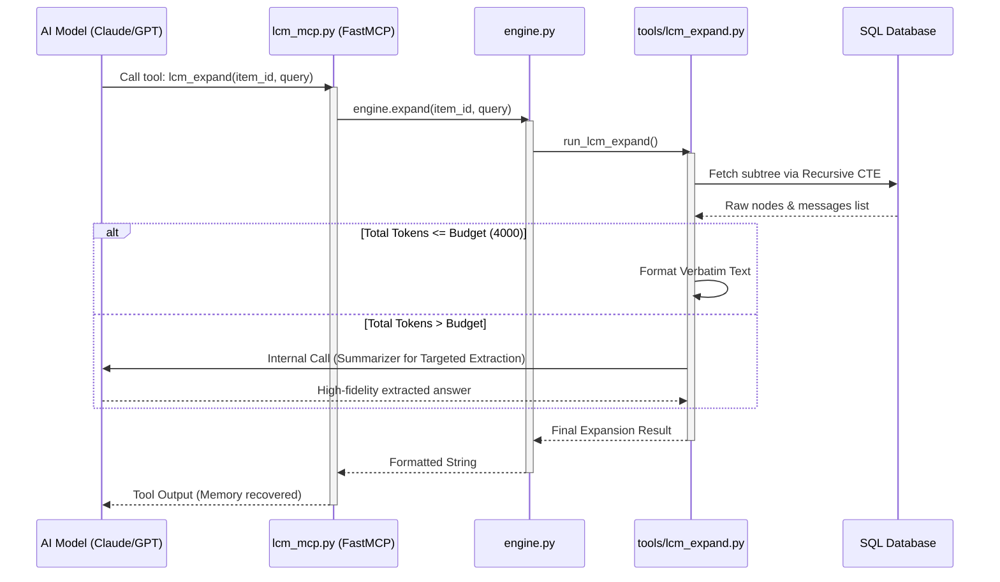

# LCM Technical Design: Part 5 - Agent Interface (MCP Toolchain)

Tài liệu này bóc tách kiến trúc tầng giao tiếp dành cho Agent, tập trung vào cách LCM cung cấp các khả năng tìm kiếm, mô tả và "giải nén" bộ nhớ thông qua giao thức Model Context Protocol (MCP).

---

## 1. Mục đích chung

Tầng Giao Diện Agent đóng vai trò là "Cây cầu Fidelity" (Fidelity Bridge). Nó chuyển đổi các cấu trúc dữ liệu DAG phức tạp và các truy vấn SQL đệ quy thành các API mà LLM có thể gọi được. Mục tiêu cốt lõi là giúp Agent:
- **Tìm kiếm**: Định vị thông tin trong hàng triệu token hội thoại cũ.
- **Lập kế hoạch**: Kiểm tra metadata của một vùng nhớ trước khi quyết định đọc chi tiết (tiết kiệm token).
- **Phục hồi**: Lấy lại chính xác dữ liệu gốc (Lossless) để phục vụ suy luận logic cao cấp.

---

## 2. Chi tiết từng file

### lcm_mcp.py (FastMCP Bridge)
- **Trách nhiệm**: Tệp tin này khởi tạo Server **FastMCP** và đăng ký các công cụ Memory. Nó đóng vai trò là điểm tiếp nhận yêu cầu từ Model Host và chuyển hướng chúng đến `LcmEngine`.
- **Input**: Các Tool Calls từ LLM (JSON).
- **Output**: Chuỗi kết quả tóm tắt hoặc nội dung gốc (Verbatim) gửi trả lại cho Model.

### tools/lcm_grep.py (Keyword Search Tool)
- **Trách nhiệm**: Thực hiện tìm kiếm từ khóa trên toàn bộ đồ thị bộ nhớ (cả tin nhắn thô và các bản tóm tắt). Nó dán nhãn chính xác "Depth" cho từng kết quả để Agent biết thông tin đó nằm ở tầng nén nào.
- **Input**: `query` (Từ khóa tìm kiếm).
- **Output**: Danh sách kết quả được định dạng kèm theo ID và Độ sâu (`[Depth X | ID: abc]`).

### tools/lcm_describe.py (Metadata Inspector)
- **Trách nhiệm**: Cung cấp "Cái nhìn X-quang" vào một Nút bộ nhớ. Nó tiết lộ số lượng token gốc (`srcTok`), số lượng token của các nút con (`descTok`) và danh sách các nút con (`child_manifest`).
- **Input**: `item_id`.
- **Output**: JSON chứa metadata và danh sách các con giúp Agent lập kế hoạch truy xuất.

### tools/lcm_expand.py (Lossless Expansion Tool)
- **Trách nhiệm**: Đây là công cụ quyền lực nhất. Nó thực hiện "giải nén" một bản tóm tắt bằng cách gọi truy vấn đệ quy để lấy lại dữ liệu nguyên bản.
- **Logic rẽ nhánh**: 
    - Nếu tổng dung lượng con < 4000 tokens: Trả về trực tiếp nội dung gốc (**Verbatim**).
    - Nếu > 4000 tokens: Gọi LLM để thực hiện nén có mục tiêu (**Targeted Extraction**) dựa trên câu hỏi của Agent.
- **Input**: `item_id`, `query` (Mục tiêu tìm kiếm cụ thể).
- **Output**: Nội dung gốc hoặc văn bản trả lời chính xác cao (High Fidelity).

---

## 3. Workflow thực thi (Step-by-Step)

Quy trình một Agent truy xuất ký ức diễn ra như sau:

1. **Step 1: Discovery (lcm_grep)**  
   Agent nhận thấy mình thiếu thông tin, nó gọi `lcm_grep(query='magic artifacts')`. Hệ thống trả về một danh sách các bản tóm tắt và tin nhắn liên quan.

2. **Step 2: Planning (lcm_describe)**  
   Agent thấy một bản tóm tắt thú vị có ID `sum_abc`. Thay vì mở ngay, nó gọi `lcm_describe(item_id='sum_abc')` để xem bản tóm tắt này chứa bao nhiêu dữ liệu gốc bên dưới.

3. **Step 3: Expansion Decision**  
   - **Nhánh A (Dữ liệu nhỏ)**: Agent thấy `descTok` chỉ có 800. Nó gọi `lcm_expand(item_id='sum_abc')`. Hệ thống trả về toàn bộ nội dung gốc (Verbatim) của 10 tin nhắn đã nén.
   - **Nhánh B (Dữ liệu lớn)**: Agent thấy `descTok` lên tới 20,000. Nó gọi `lcm_expand(item_id='sum_abc', query='What color was the dragon's egg?')`. Hệ thống sẽ dùng LLM lọc qua 20,000 token đó để chỉ lấy ra đúng thông tin về quả trứng rồng.

---

## 4. Sơ đồ Mermaid: Agent Memory Retrieval Flow

---
*Tài liệu này thuộc kho tài liệu kỹ thuật cốt lõi của AgenticOS.*
