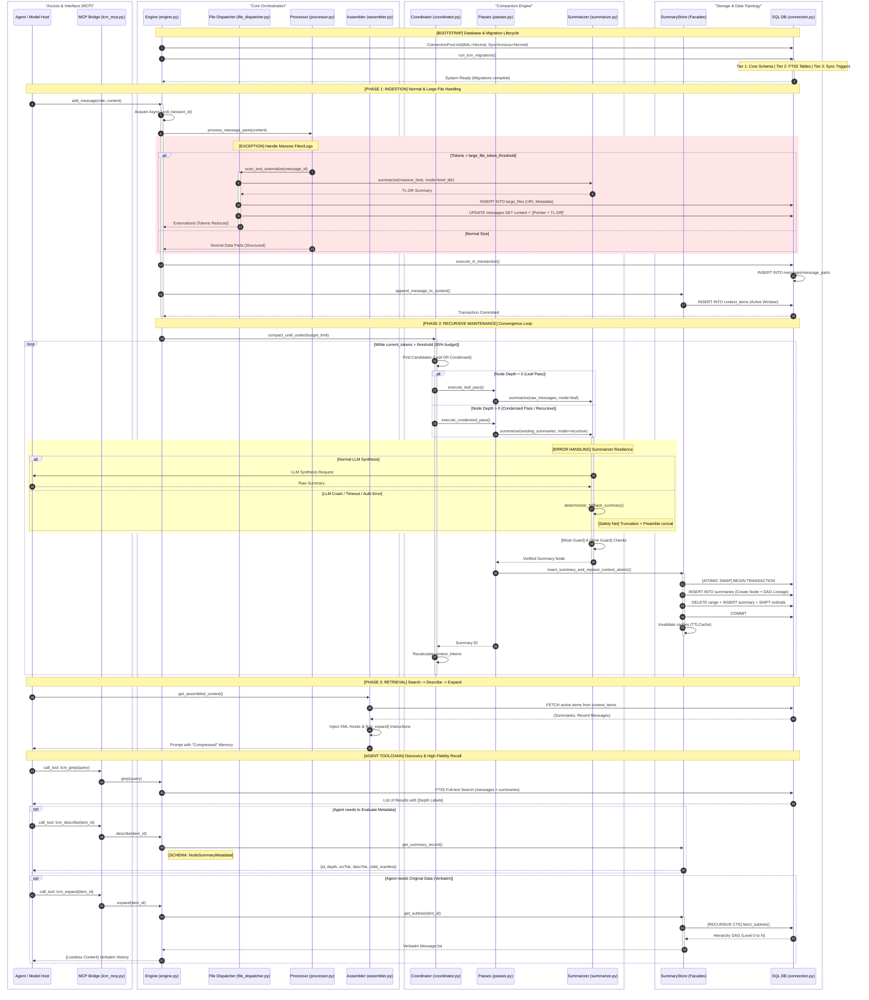

# LCM Master Workflow: The Unified Technical Lifecycle

Tài liệu này là bản đặc tả quy trình vận hành (Workflow) cao nhất của hệ thống Lossless Context Management (LCM). Nó hợp nhất toàn bộ logic từ 5 tầng kiến trúc, bao gồm cả các thành phần xử lý ngoại lệ và cơ chế phục hồi dữ liệu.

## 1. Unified Master Sequence Diagram

Sơ đồ dưới đây mô tả toàn bộ vòng đời của dữ liệu: Từ khởi tạo DB, nạp tin nhắn (xử lý file lớn), nén đệ quy đa cấp, cho đến khi Agent truy xuất tìm kiếm chuyên sâu.



---

## 2. Cấu trúc dữ liệu (Object Schemas)

Để Agent có thể suy luận chính xác, hệ thống cung cấp dữ liệu theo các Schema chuẩn hóa sau:

### 2.1 Node Metadata (Kết quả `lcm_describe`)
```json
{
  "id": "sum_8a2b3c4d",
  "depth": 2,           // Cấp độ nén (0: Gốc, 1: Tóm tắt cấp 1, 2+: Đệ quy)
  "srcTok": 12450,      // Tổng số token gốc "ẩn" dưới node này
  "descTok": 1500,      // Dung lượng token thực tế của các node con trực tiếp
  "content_preview": "Hội thoại về thiết kế hệ thống...",
  "child_manifest": [   // Danh mục tóm tắt cấp dưới giúp Agent chọn luồng expand
    {"id": "sum_1", "tokens": 400, "depth": 1},
    {"id": "sum_2", "tokens": 350, "depth": 1}
  ]
}
```

### 2.2 Expansion Grant
Khi thực hiện `lcm_expand`, nếu dữ liệu quá lớn, hệ thống sẽ cấp một quyền ủy quyền (`DelegationGrant`) để Sub-agent thực hiện trích lọc thông tin.

---

## 3. Chiến lược Xử lý lỗi (Error Handling & Resilience)

LCM được thiết kế với tư duy "Fail-safe", đảm bảo bộ nhớ không bao giờ bị korrupt dù AI Engine gặp lỗi:

1.  **AI Summarizer Failure**: Khi LLM không thể tóm tắt (timeout/crash), hệ thống kích hoạt `deterministic_fallback_summary()`. Phương pháp này sử dụng thuật toán cắt tỉa (Sliding Window) để giữ lại 30% đầu và 30% cuối của văn bản gốc, nối lại bằng thẻ `[...]`. **Kết quả**: Luôn có tóm tắt để giải phóng RAM, dù chất lượng nội dung có thể giảm nhẹ.
2.  **The Bloat Guard**: Nếu LLM "nói hươu nói vượn" dẫn đến bản tóm tắt dài hơn cả văn bản thô, hệ thống sẽ tự động vứt bỏ (Discard) kết quả nén đó và thử lại với `aggressive=True` hoặc dùng fallback.
3.  **Atomic Integrity**: Mọi thao tác thay đổi cấu trúc Context Window đều nằm trong `BEGIN IMMEDIATE TRANSACTION`. Nếu ổ đĩa đầy hoặc lỗi SQL, toàn bộ quy trình sẽ ROLLBACK về trạng thái trước khi nén để tránh việc mất ký ức của người dùng.
4.  **Chaos Guard**: Tại tầng Processor, bất kỳ tin nhắn nào vượt quá 50,000 ký tự sẽ bị ép buộc cắt tỉa hoặc đẩy sang File Dispatcher ngay lập tức để bảo vệ tài nguyên tính toán token.

---
*Bản đặc tả Master Workflow này là tài liệu tham chiếu chính thức cho toàn bộ module LCM trong AgenticOS.*
